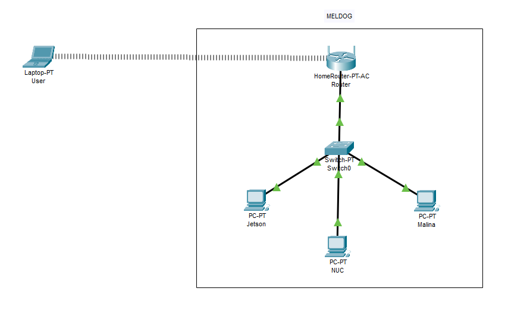
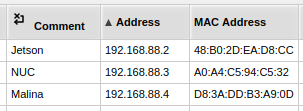

# Dokumentacja lokalnej sieci komputerowej w robocie kroczącym Meldog

Dokument opisuje sposób komunikacji pomiędzy urządzeniami komputerowymi znajdującymi się w robocie kroczącym Meldog.

# Lista używanych urządzeń komputerowych i sieciowych

1. Minikomputer Jetson 
2. Minikomputer NUC
3. Raspberry Pi 
4. Routerboard L23UGSR-5HaxD2HaxD pełniący funkcję routera
5. Switch ASW-5-50-OF

# Topologia sieci

# Konfiguracja routera 

Zastosowany routerboard pracuje pod kontrolą systemu operacyjnego RouterOS firmy MikroTik.
## Komunikacja

Lokalna sieć robota Meldog posiada dostęp do internetu realizowany poprzez połączenie bezprzewodowe Wi-Fi z nadrzędną siecią lokalną, działającą w paśmie 2,4 GHz. Interfejs ten pełni funkcję łącza WAN.

Własna sieć bezprzewodowa Wi-Fi udostępniana przez router pracuje w paśmie 5 GHz.

## Statyczne adresy IP

Jetson, NUC oraz Raspberry Pi posiadają statyczne przypisania adresów IP skonfigurowane w serwerze DHCP. Oznacza to, że po podłączeniu do sieci urządzeniom tym automatycznie przydzielany jest wcześniej zdefiniowany adres IP, bez konieczności ręcznej konfiguracji adresacji po stronie urządzeń.

**Sam router ma adres IP: 192.168.88.1**
## Ograniczenia

Interfejs bezprzewodowy routera pracujący w paśmie 2,4 GHz pełni rolę łącza WAN, poprzez które router łączy się z nadrzędną siecią lokalną  i uzyskuje dostęp do internetu. 

Należy uwzględnić możliwość, że niektóre urządzenia  nie obsługują pasma 5 GHz, co uniemożliwi im połączenie z lokalną siecią Wi-Fi.
# Linki zewnętrzne

Specyfikacja RouterBoard L23UGSR-5HaxD2HaxD

[https://help.mikrotik.com/docs/spaces/UM/pages/253919358/L23UGSR-5HaxD2HaxD](https://help.mikrotik.com/docs/spaces/UM/pages/253919358/L23UGSR-5HaxD2HaxD "https://help.mikrotik.com/docs/spaces/UM/pages/253919358/L23UGSR-5HaxD2HaxD")

Specyfikacja switcha

[https://atte.pl/ASW-5-50-OF](https://atte.pl/ASW-5-50-OF "https://atte.pl/ASW-5-50-OF")

